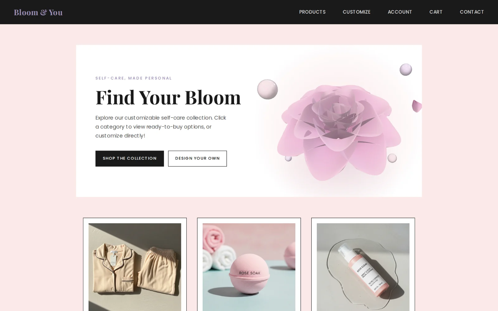
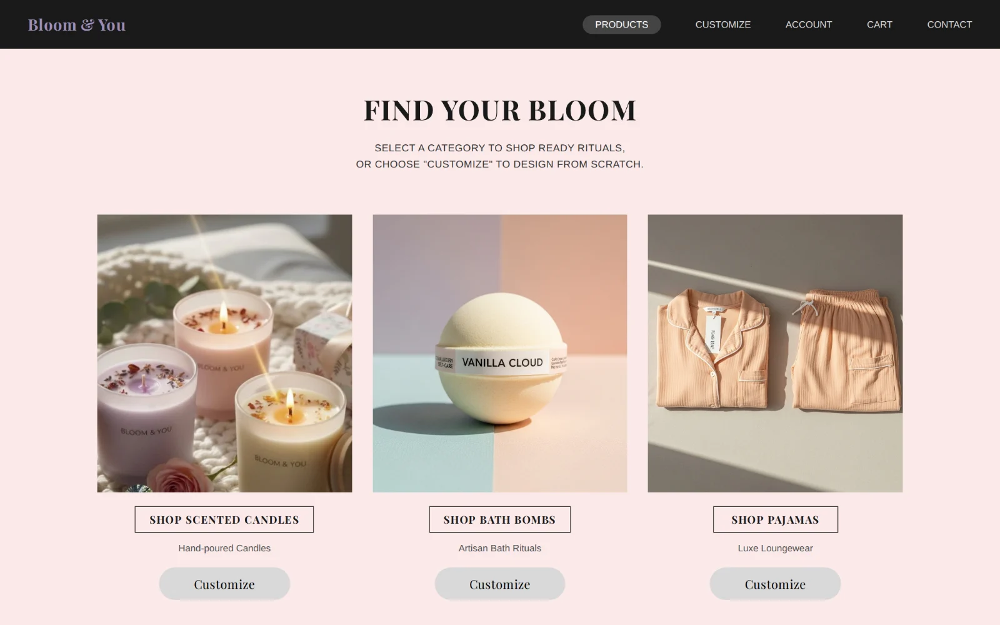
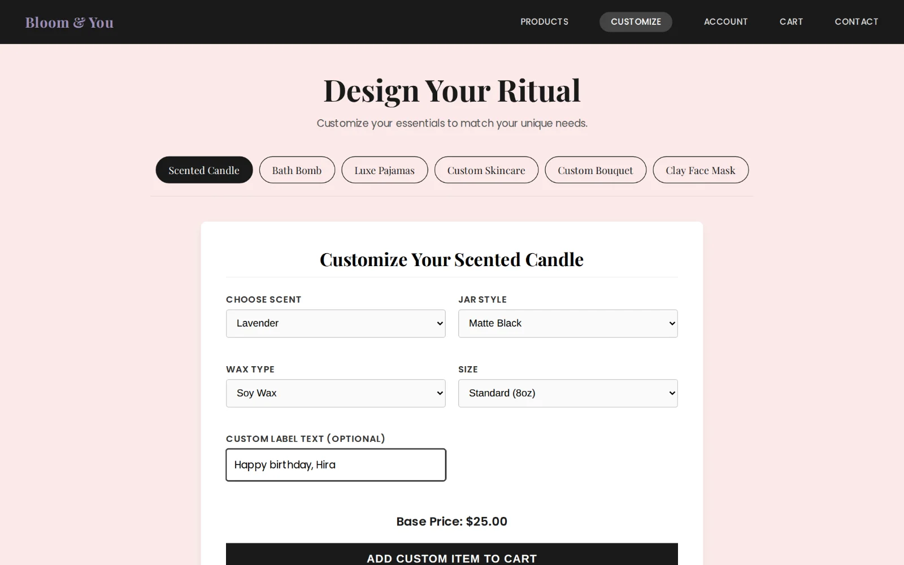
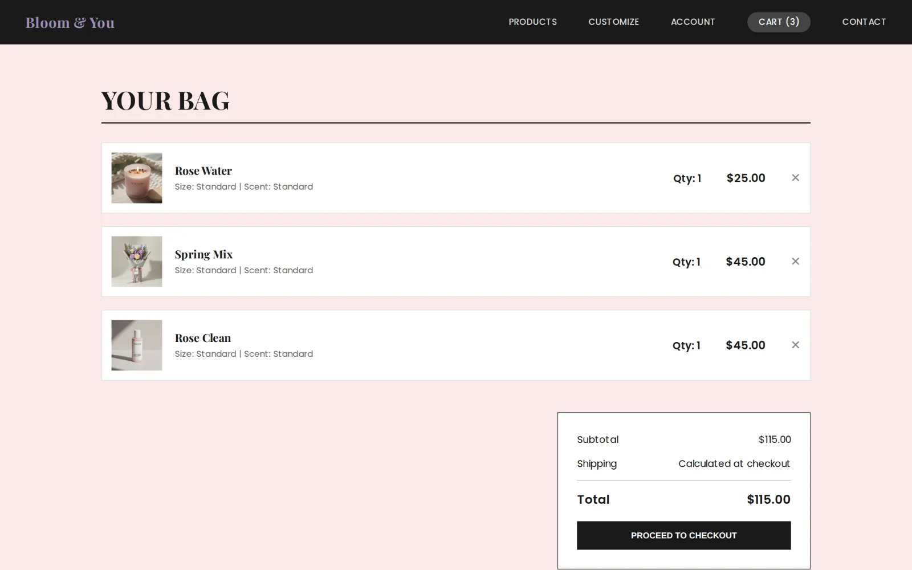
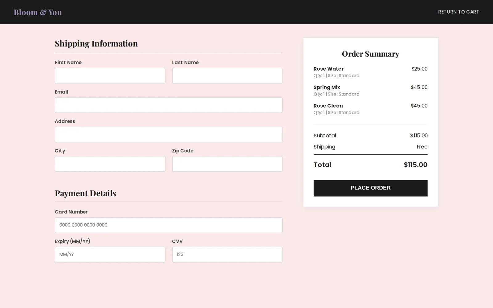
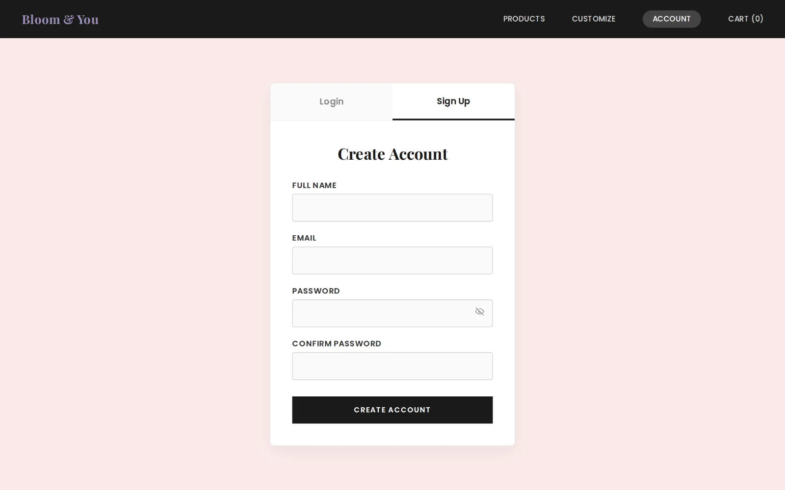
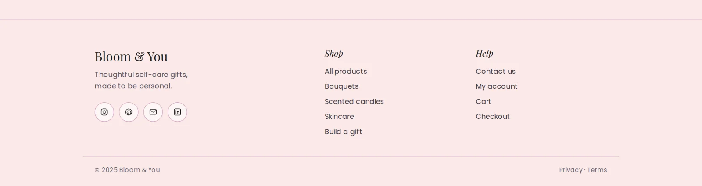
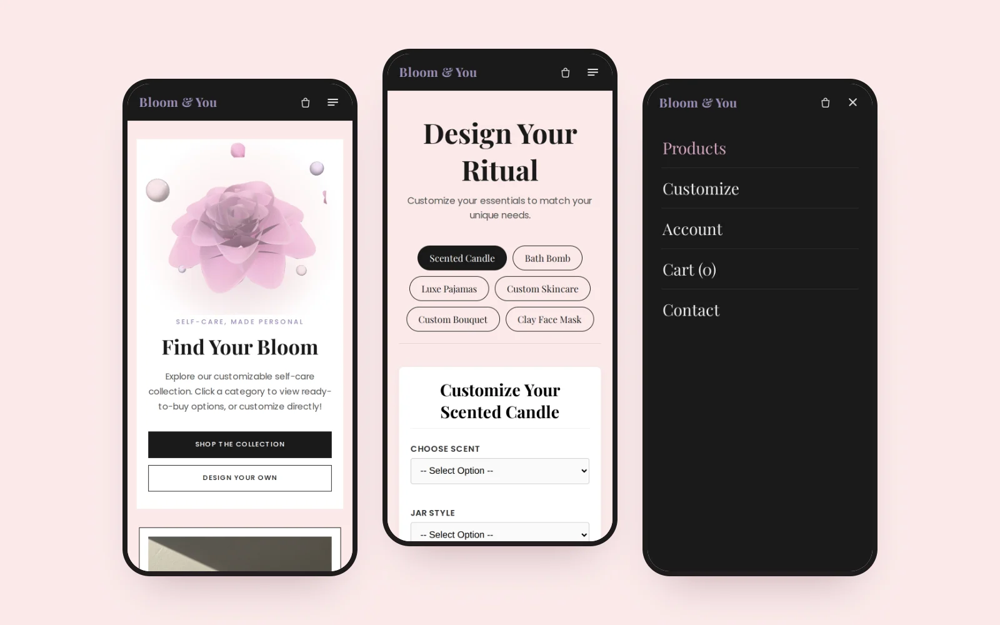

<div align="center">

# Bloom & You

**A self-care gift store: browse, customise and order.**

**[Live site](https://bloom-and-you-app.vercel.app)**



</div>

## About

Bloom & You is an e-commerce front end for self-care gifts: pyjamas, bath bombs, skincare,
scented candles, face masks and bouquets. Visitors can browse by category, design their own
gift in the customiser, keep a cart, create an account and check out.

## Features

- A 3D rose on the home page that blooms open on load, built with Three.js (loaded on demand, paused off-screen, still for reduced motion)
- Category pages for six product lines, each with its own gallery
- **Customiser** for building a personalised gift
- **Cart** shared across pages with React Context, with live item counts in the navigation
- **Accounts:** sign up and log in
- **Checkout** and a **contact form** that post to a REST API; contact messages land in the owner's inbox
- Client-side routing with React Router, and a soft brand palette throughout
- Laid out for phones from 360px up, with a shared footer and line icons

## Screenshots

| Products | Customise |
| --- | --- |
|  |  |
| **Bag** | **Checkout** |
|  |  |
| **Account** | **Footer** |
|  |  |

<p align="center"></p>

## Tech stack

| Layer | Technology |
| --- | --- |
| Front end | React 19, React Router 7, Vite, CSS, Three.js |
| State | React Context (cart) |
| API | Node.js, Express and MongoDB (accounts, checkout, contact) |
| Hosting | Vercel |

## Project structure

```
bloom-and-you/
├── frontend/
│   ├── src/
│   │   ├── pages/        One component per page (Home, Products, Customize, Cart, Account, Checkout, Contact, categories)
│   │   ├── components/   SiteHeader, Footer, BloomScene (3D hero)
│   │   ├── context/      CartContext
│   │   ├── styles/       Page styles
│   │   ├── assets/       Product images
│   │   └── api.js        Backend address (VITE_API_URL)
│   ├── vercel.json       Routes every URL to the app so deep links work
│   └── package.json
├── backend/
│   ├── app.js            Express app (CORS, JSON, routes, errors)
│   ├── server.js         Local server on port 5000
│   ├── api/index.js      Vercel serverless entry
│   ├── routes/           auth (register, login), orders (checkout), contact
│   ├── lib/notify.js     Emails contact messages (Resend)
│   ├── models/           User, Order, ContactMessage (Mongoose)
│   └── .env.example
└── docs/screenshots/
```

## API

Every response is JSON with `success` and `message`.

| Method | Path | Body | Notes |
| --- | --- | --- | --- |
| POST | `/register` | `name, email, password` | Password hashed with bcrypt (cost 10). Duplicate emails are rejected. |
| POST | `/login` | `email, password` | Returns `user: { id, name, email }`. |
| POST | `/checkout` | `userId, items, total, shippingInfo` | Recomputes the total on the server and saves the order with status `placed`. |
| POST | `/contact` | `name, email, message` | Saves the message and emails it to the shop owner (Reply goes straight to the customer). |
| GET | `/health` | | Shows whether the database is connected. |

## Run it locally

```bash
# API
cd backend
cp .env.example .env   # add your MongoDB connection string
npm install
npm run dev            # http://localhost:5000

# Shop, in a second terminal
cd frontend
npm install
npm run dev            # http://localhost:5173
```

The shop calls the API at `VITE_API_URL` (default `http://localhost:5000`).
Copy `frontend/.env.example` to `frontend/.env` to change it.

## Deploy

The shop and the API are two Vercel projects from this one repository.

1. **API:** import the repository, set **Root Directory** to `backend` and add
   `MONGO_URI` (MongoDB Atlas connection string) and `CORS_ORIGIN` (the shop's URL).
   To get contact messages by email, also add `RESEND_API_KEY` (free at resend.com) and `CONTACT_TO` (your inbox).
   Open `/health` on the new URL to check the database is connected.
2. **Shop:** Root Directory `frontend` (framework: Vite). Set `VITE_API_URL` to the API's URL and redeploy.

## Author

**Minahil Nadeem** · [GitHub](https://github.com/minahilnadeem6688) · [LinkedIn](https://www.linkedin.com/in/minahil-nadeem23)

## License

[MIT](LICENSE)
